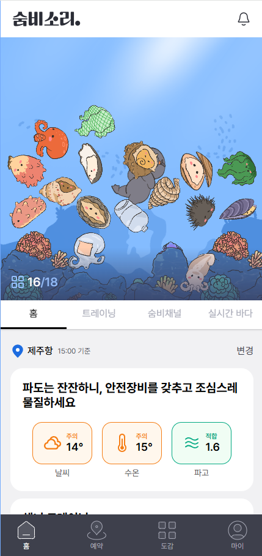

# 포트폴리오

### Contact & Channels

---

✉️ **Email** | **ancjs369@naver.com**

📱 **Phone** | **010-9380-1663**

*🐱* **Github** | **[https://github.com/yongseong2](https://github.com/yongseong2)**

🎂**Birth** | **1996-09-28**

👦 **Linked-in**: [**https://www.linkedin.com/in/seongyong-kim-048a49297**](https://www.linkedin.com/in/seongyong-kim-048a49297)

📗**Blog**| **** [**https://velog.io/@yongseong2/posts**](https://velog.io/@yongseong2/posts)

# 🛠  Skills

---

### 📕 **Language**

**Typescript**

- 확장성을 위해 Typescript 사용을 주저하지 않습니다. 객체 타입과 주요 tsconfig의 설정을 이해하고 있습니다.

**Javascript(ES6)**

- ES6 자바스크립트 문법을 주로 활용합니다.
- 코드의 재사용성과 가독성 향상을 위해 함수형 프로그래밍을 사용합니다.

### 📗 **Framework/Library**

**React**

- 아토믹 컴포넌트 설계 기반의 Storybook을 활용한 디자인 시스템을 서류로 남기며 구축해본 경험이 있습니다.
- 프로젝트 초기 설정 및 최신 개발 환경 구축 (eslint, prettier, next.config.js, cypress)을 다수 해본 경험이 있습니다.
- 최신 CSS in JS 를 사용했습니다. styled-components, emotion, tailwind 등 다양한 CSS 구조에 익숙합니다.
- 불필요한 props drilling을 피하며, 전역 상태 관리 환경을 구축합니다.

**Next js 13**

- Next js 와 Postgres DB, Prisma 를 활용한 풀스택 개발 경험이 있습니다.
- data fetching을 활용하기 위해 axios 사용 대신 data 캐싱이 적용되는 라이브러리를 활용하였습니다. 특히, SSR, SSG, ISR 적용을 고민하여 페이지를 설계한 경험이 있습니다.
- SEO를 적용하여 배포 후 서비스 검색 결과를 상위에 노출 시킨 경험이 있습니다.

**turborepo**

- 세 가지의 서비스를 분기하며 의존성을 분리해본 경험이 있습니다.
- 공통된 컴포넌트,페이지, 훅들을 package로 분리했습니다.

**React Native**

- React Native CLI의 주요 컴포넌트와 속성을 공식 문서를 참고하여 개발한 경험이 있습니다.
- 플레이스토어 배포를 위해 검토사항을 고려하여 오류 테스팅과 빌드 최적화 과정을 경험하였습니다.

**Vue**

- methods, computed, 그리고 watch 간의 차이점을 이해하며 프로젝트를 진행해본 경험이 있습니다.

### 📘**Package Manager**

**Yarn Berry**

- React와 Next js에 도입하여 CI 향상, Zero Install을 구축한 경험이 있습니다.
- 프로젝트의 요구사항에 맞게 Webpack과 Babel 설정을 수정 및 최적화한 경험이 있습니다.

### 📔**Collaboration  & Tool**

**Git**

- Git Flow를 이해하며 master, develop, feature, hotfix 등의 브랜치 전략을 수립하여 개발을 진행하였습니다.

**JIRA**

- 애자일 기반의 프로젝트 관리를 진행하였습니다. 스프린트 단위로 일정을 조율하며 협업하였습니다.

# 💻  Projects

---

# 숨비소리

2024.10.29 ~ 

제주 해녀 문화보존 프로젝트

**구름톤 인 제주 11기 최우수상**

**팀 프로젝트 역할배분**

- 기획자 1명 / 디자이너 1명 / 백엔드 1명 / 프론트엔드 2명
- 해커톤 이후 추가 기능:
    - 디자이너 1명/ 백엔드 1명 / 프론트엔드 1명

**프로젝트 결과물**

- Github: [https://github.com/sumbisori](https://github.com/sumbisori)
- 배포링크: [https://www.sumbisori.site](https://www.sumbisori.site/login)
- 후기1: [https://velog.io/@yongseong2/후기-구름톤-in-JEJU-11기-프론트엔드-개발-참가-후기](https://velog.io/@yongseong2/%ED%9B%84%EA%B8%B0-%EA%B5%AC%EB%A6%84%ED%86%A4-in-JEJU-11%EA%B8%B0-%ED%94%84%EB%A1%A0%ED%8A%B8%EC%97%94%EB%93%9C-%EA%B0%9C%EB%B0%9C-%EC%B0%B8%EA%B0%80-%ED%9B%84%EA%B8%B0)
- 후기2: [https://velog.io/@yongseong2/후기-구름톤-in-JEJU-11기-프론트엔드-개발-참가-후기2](https://velog.io/@yongseong2/%ED%9B%84%EA%B8%B0-%EA%B5%AC%EB%A6%84%ED%86%A4-in-JEJU-11%EA%B8%B0-%ED%94%84%EB%A1%A0%ED%8A%B8%EC%97%94%EB%93%9C-%EA%B0%9C%EB%B0%9C-%EC%B0%B8%EA%B0%80-%ED%9B%84%EA%B8%B02)

**활용한 기술스택**

- `Typescript` `React` `TailWind CSS` `tanstack query` `Zustand` `framer-motion`

**담당 역할**

- 컴포넌트 구조를 활용하여 각 UI 요소를 재사용 가능한 구성 요소로 분리
- AWS amplify를 활용한 배포
- tailwind의 커스터마이징 기능을 이용해 스타일 가이드에 맞는 색상 팔레트와 테마를 설정
- matter.js를 활용한 수족관 2D 물리 엔진 기능 구현
- 해양수산부 API를 활용하여 실시간 수온, 물 때 데이터 연동
- 네이버 지도 API를 활용하여 제주도 지도 페이지 구현
- 해산물 이미지 s3에 업로드 및 chat gpt를 활용한 해산물 갯수 파악 기능 구현
- 모바일 기기 반응형 화면 구현

- tailwind.config에 미리 등록하여 색상을 변수화 하여 사용했습니다.
- Text, Spacing 등 일관된 스타일을 구현하기 위해 컴포넌트를 작은 단위부터 구현했습니다.

- matter.js 를 활용하여 다이버, 해산물, 돌, 배경 레이어 특성을 정의하며 구현하였습니다.
- 구현 과정: [https://velog.io/@yongseong2/Matter.js-사용기](https://velog.io/@yongseong2/Matter.js-%EC%82%AC%EC%9A%A9%EA%B8%B0)

- 사용자의 입력을 받는 form을 효율적으로 관리 및 유효성 검사를 위해 zustand 와 react-query mutation을 활용했습니다.
    - form 과정(Funnel)을 벗어 날 때 초기화 하거나 요구 사항에 따라 임시 저장이 가능하게 설계 했습니다.
- 해산물 이미지 올릴 때 아래와 같은 과정을 거칩니다.
    1. 이미지를 S3에 업로드한 후, 업로드 전 로컬 이미지는 화면에 낙관적으로 표시됩니다. 
    2.  S3 업로드에 성공한 경우 AI 이미지 분석 API를 호출합니다.
    3.  위 과정이 진행 될 때 이미지는 pending 상태를 가지면서 로딩 바에서 숫자가 올라가는 애니메이션을 확인합니다.
    4. 단일 이미지가 아니라 복수의 이미지를 처리하게 위해 Promise.all을 활용했습니다. 과정을 거친 이미지들은 pending에서 complete 상태로 변경되면서 응답 받은 해산물 종류와 개수를 표시합니다.
- 체험일지 목록 페이지: useInfiniteQuery를 활용하여 grid cols가 1개, 2개, 3개 별로 무한 스크롤을 구현하였습니다.

## 나뭇잎 롤링페이퍼

2024.03.15~2024.04.15

나뭇잎으로 구성된 롤링 페이퍼 공유 어플리케이션

**프로젝트 결과물**

- Github: [https://github.com/yongseong2/rolling-leaf](https://github.com/yongseong2/rolling-leaf)
- URL: [https://rolling-leaf.vercel.app](https://rolling-leaf.vercel.app/login)

**활용한 기술스택**

- `Typescript` `Next.js 14` `Prisma` `next-auth` 
`PostgreSQL` `Redux-toolkit` `TailWind CSS`  `React-Query`

**담당 역할**

- 풀스텍 개발
- api router를 활용한 백엔드 CRUD 구현
- next-auth 기반 Oauth 카카오톡 로그인 구현
- react-draggble를 활용한 드래그 앤 드랍이 가능한 편지 UI 기능

## ZigLog

2023.10.09~2023.11.20

📘**지식그래프로 확인하는 문서 툴**

**삼성 청년SW아카데미 자율 주제 프로젝트 우수상**

노트 내용(지식)에도 각각 연결관계가 있음을 생각하며 지식 그래프를 고안했습니다. 노트 참조 관계 그래프, 폴더 트리 그래프, 모든 사용자의 그래프를 제공하는 문서 관리 서비스를 개발하였습니다. 

**팀 프로젝트 역할배분**

- 프론트엔드 4명 / 백엔드 2명

**프로젝트 결과물**

- Github: [https://github.com/BittleBeatles/Ziglog](https://github.com/BittleBeatles/Ziglog)
- 시연영상: [https://www.youtube.com/watch?v=tOWOvG0jEx8](https://www.youtube.com/watch?v=tOWOvG0jEx8)

**활용한 기술스택**

- `Typescript` `Next.js`   `Cypress` `Storybook` `Redux-toolkit` `TailWind CSS`  `Yarn Berry`  `Three.js` `return-fetch`

**담당 역할**

- 프론트엔드 개발 담당
- 공통 UI 컴포넌트 개발(폴더 탐색, 북마크, 인풋, 버튼)
- 지식 그래프 개발 및 커스텀(2D, 3D, 모든 유저 노트를 포함하는 그래프)
- 에러 핸들링 페이지 적용 및 API 요청 오류 발생 시 안내문구 출력
- 랜딩페이지 SEO 적용 - 구글에 Ziglog 검색시 상위 노출
- Next.js 기반 캐시 최적화 : return-fetch 라이브러리를 활용한 네트워크 요청 모듈화( [https://return-fetch.myeongjae.kim/](https://return-fetch.myeongjae.kim/))
- 프로젝트 초기 설정 및 컴포넌트 주도 개발 환경 구축 (eslint, prettier, next.config.js, storybook, tsconfig.json, cypress)
- 라이트모드/다크모드 구현

### 주요개발사항

**개인페이지**

- 폴더탐색기: 각각의 폴더 또는 노트 컴포넌트를 재귀적으로 호출하였습니다. 특히, 폴더 생성시에는 각각의 부모폴더 id를 파악하는 로직을 호출하여 사용자 입장에서 생각되는 위치에 폴더가 생성되도록 구현하였습니다.
- 2D 그래프 커스텀을 위해 CanvasRenderingContext2D 객체를 조작하였습니다. 또한 3D로 구체를 렌더링 하기위해 Three.js의 객체를 생성하였습니다.

**검색페이지**

- 모든 사용자의 노트 참조관계를 그래프로 확인 할 수 있습니다.
- 검색결과에 무한 스크롤링을 적용하여 공개된 노트를 조회할 수 있습니다.

**Atomic 디자인 기반의 CDD 진행으로 Storybook 사용**

- 각 컴포넌트의 사용법과 속성을 명확하게 해, 팀원들이 컴포넌트를 쉽게 이해하고 사용할 수 있도록 하였습니다.

---

## 베네픽

2023.08.21~2023.10.06 (7주)

💳**위치 기반 카드 추천 서비스**

**삼성 청년SW아카데미 핀테크 트랙 우수상**

사용자의 주변 가맹점 위치를 파악하고 해당 가맹점에서 최대 혜택을 받을 수 있는 신용카드를 추천하는 서비스

**팀 프로젝트**

- 프론트엔드 2명 / 백엔드 4명

**프로젝트 결과물**

- Github: [https://github.com/Benepick/Benepick](https://github.com/Benepick/Benepick)
- 시연영상: [https://www.youtube.com/watch?v=KMJX3GOS7eo](https://www.youtube.com/watch?v=KMJX3GOS7eo)
- 플레이스토어: [https://play.google.com/store/apps/details?id=com.benepick&hl=ko-KR](https://play.google.com/store/apps/details?id=com.benepick&hl=ko-KR)

**활용한 기술스택**

- `Typescript` `React Native` `React-Navigation` `Redux-toolkit`

**담당 역할**

- 프론트엔드 개발 담당
- build.gradle 설정 최적화 및 플레이스토어 배포
- axios의 인터셉터, 인스턴스를 활용한 네트워크 요청 모듈화
- 위치기반 추천 페이지(권한 승인을 통한 조회)
- 혜택 및 소비 내역 페이지(월별 소비 내역 조회, SVG를 활용한 그래프 구현) 개발
- 챗봇 페이지(답변 내용 기반의 옵션 선택 기능) 개발
- 혜택 검색 페이지 개발

**챗봇**

- 카드의 다양한 혜택 정보를 사용자에게 효과적으로 전달하고자 챗봇 서비스를 도입을 하였습니다.

**메인페이지**

- 앱을 실행하는 순간 간편 로그인이 활성화 된다면, 자신의 위치에 따른 카드 추천을 받을 수 있도록 메인 페이지를 구현하였습니다.

**혜택 및 소비 내역 그래프**

- 그래프 라이브러리를 활용하는 대신, 세밀한 조정과 특별한 디자인을 위해 SVG를 직접 코드로 생성하였습니다.

**장소 기반 혜택 검색**

- 사용자가 장소를 검색할 때, 보유한 카드의 최대 혜택을 추천하며 해당 장소에서 최고 혜택을 제공하는 다른 카드도 함께 제시됩니다.

---

## 입찰왕

2023.07.04~2023.08.18 (7주)

🪙**쉽고 재미있는 라이브 경매 플랫폼, 입찰왕**

**삼성 청년SW아카데미 웹기술 트랙 우수상**

라이브 영상 경매 서비스를 개발하였습니다. 판매자는 경매방 관리를, 구매자는 물품을 실시간으로 입찰하며 상호작용할 수 있는 환경을 제공하였습니다.

**팀 프로젝트**

- 프론트엔드 2명 / 백엔드 4명

**프로젝트 결과물**

- Github: [https://github.com/bid-king/bidking](https://github.com/bid-king/bidking)
- 시연영상: [https://www.youtube.com/watch?v=iyUf4gSRbaA](https://www.youtube.com/watch?v=iyUf4gSRbaA)

**활용한 기술스택**

- `Typescript` `React, Redux-toolkit` `Emotion`  `Yarn berry`  `Storybook` `React-query`

**담당 역할**

- 프론트엔드 개발 담당
- 메인페이지 및 Scroll event 수신 시 쓰로틀링을 이용한 API 요청으로 무한 스크롤 경매방 탐색 기능
- Openvidu를 활용한 판매자 실시간 화면 송출 기능(1:N)
- Socket.io를 활용한 경매방 구매자간의 채팅 기능
- SSE를 활용한 알림 수신 기능 및 알림 내역 조회 기능
- 토큰 기반의 회원 인증 및 갱신 기능(Access Token, Refresh Token 활용)
- 경매방 생성, 수정, 삭제 기능
- 판매자와 구매자를 구분하는 다크모드와 라이트모드 기능

**경매진행 페이지**

- 판매자는 Openvidu로 상품을 실시간 송출하고, 구매자는 동시에 이를 시청하여 다수와 함께 경매에 참여합니다.
- 판매자와 구매자 간의 실시간 채팅을 지원하며, 판매자는 채팅방 참여자의 닉네임을 확인할 수 있습니다.

**메인페이지 (구매자 페이지)**

- 메인페이지의 경매 목록 탐색에 카테고리 및 무한 스크롤링 기능을 도입하였습니다.

# 🎈 Experiences

---

## SSAFY 9기

[https://www.ssafy.com/](https://www.ssafy.com/ksp/jsp/swp/swpMain.jsp)
2023.01 ~ 2023.12

- 삼성청년SW아카데미
- Python, 자료구조, 알고리즘, JavaScript, Django 등 기초적인 Web 개발 역량 학습 과정
    
    

# 🎓  Education

---

## 서경대학교

2016.03 ~ 2021.02.

- 산업경영시스템공학 전공

# 📜  English

---

## TOEIC

2022.10.30

- **730**

## TOEIC SPEAKING

2022.11.20

- **Intermediate Mid 3 (Speaking Score 130)**